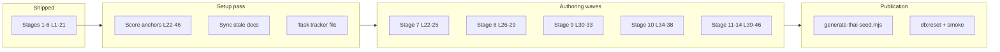

# Thai Curriculum Completion Plan

## Current state

| Scope       | Lessons            | Status                                                                                                                         |
| ----------- | ------------------ | ------------------------------------------------------------------------------------------------------------------------------ |
| Stages 1–6  | 1–21               | **Done** — [`src/lib/data/thai.ts`](src/lib/data/thai.ts), [`supabase/seed.sql`](supabase/seed.sql), delivery publication      |
| Stages 7–14 | 22–46 (25 lessons) | **Proposed only** — [`docs/curriculum/thai-reading-v1/lesson-sequence.md`](docs/curriculum/thai-reading-v1/lesson-sequence.md) |

**Decisions locked in:**

- Ship as a **`thai-reading-v1` continuation**. The curriculum manifest course ID remains `thai-reading-v1`; the runtime `thai` pack ID remains a compatibility slug until a deliberate multi-course migration changes it.
- Keep v1 lesson data in the current Thai runtime shape. Language-agnostic text-field cleanup is future app-expansion work, not a blocker for completing this curriculum.
- Continue using manually authored Thai word/syllable segmentation for v1. PyThaiNLP or other tokenizer output may support review, but it is not a publication dependency.
- Synthesis lessons **L35** (tone-class matrix) and **L38** (short diphthongs) use **representative anchor words** — no schema change. Lock L35 to `ข่าว` and L38 to `เกาะ` unless anchor scoring reveals a clear replacement.
- Include the tone-class matrix in v1 as a synthesis lesson after all four tone marks are visible. Drills assess visual reading/recognition first; pronunciation accuracy is checked during content review, not treated as an audio-production feature.
- Teach hidden-vowel frames, true clusters, and leading-`ห` as separate rule cards. Do not collapse them into one generic cluster mechanic.
- Keep `ร้านอาหาร`, `ออก`, and `ผัก` as practice/review targets unless anchor scoring later proves one should replace a planned anchor.
- Keep L14 as the authored dense lesson (`ง`, final `ง`, and `อ` as aw) because it is already shipped; flag it for playtesting rather than splitting it before Stage 7 work.
- Ship L46 as an optional recognition-only appendix. Use historical/obsolete examples such as `ฃวด` only as labeled recognition examples, not modern decoding targets.
- Treat old `docs/concept/approach-thai.md` references as **superseded** by the current curriculum artifact system (`docs/curriculum/thai.md`, `docs/curriculum/thai-reading-v1/`, and the active `.ai/curriculum/` trackers). Do not restore the old file unless a future audit finds unique surviving content.

---

## Task tracker file (create on approval)

Create [`.ai/2026-06-28-thai-curriculum-completion.md`](.ai/2026-06-28-thai-curriculum-completion.md) as the durable handoff artifact (per `AGENTS.md` task-tracking rules). Structure:

- **Goal:** Complete full-alphabet Thai reading (46 lessons, 14 stages) in `thai-reading-v1`.
- **Authority chain:** `docs/curriculum/thai-reading-v1/lesson-sequence.md` → `docs/curriculum/thai-reading-v1/anchor-candidates.scored.csv` → `src/lib/data/thai.ts` → `scripts/generate-thai-seed.mjs` → `supabase/seed.sql` → `delivery.*` publication smoke.
- **Progress checklist** by wave (below) plus doc-sync and publication gates.
- **Blockers / decisions** section (see next section).
- **Cross-links:** [`.ai/curriculum/thai.md`](.ai/curriculum/thai.md), [`.ai/curriculum/thai-reading-v1.md`](.ai/curriculum/thai-reading-v1.md), [`.ai/archive/2026-06-27-thai-full-alphabet-research.md`](.ai/archive/2026-06-27-thai-full-alphabet-research.md).

Also update [`.ai/curriculum/thai.md`](.ai/curriculum/thai.md) summary counts and open todos to point at the new tracker, and update [`.ai/curriculum/thai-reading-v1.md`](.ai/curriculum/thai-reading-v1.md) so Stage 6 authored/seeded and Stage 7+ anchor scoring status are current.

---

## Resolve before / during implementation

| Item                                                    | Status                                | Resolution                                                                                                                                                                                                                                                                                                                |
| ------------------------------------------------------- | ------------------------------------- | ------------------------------------------------------------------------------------------------------------------------------------------------------------------------------------------------------------------------------------------------------------------------------------------------------------------------- |
| Stage 7+ anchor scoring                                 | **Blocking setup**                    | Add 25 rows to [`anchor-candidates.csv`](docs/curriculum/thai-reading-v1/anchor-candidates.csv) with every required numeric scoring column populated (`0`–`1`, penalties before notes), run `pnpm curriculum:score`, review weak-band rows before authoring each wave, and record any accepted weak anchor with rationale |
| L35 / L38 synthesis anchors                             | **Decided**                           | Use `ข่าว` for L35 tone-class synthesis and `เกาะ` for L38 short-diphthong synthesis unless anchor scoring reveals a clearly better replacement; both remain review/synthesis lessons with no schema change                                                                                                               |
| L46 recognition-only (no decoding drill)                | **Decided**                           | Ship as optional recognition-only appendix unless later review rejects it; use recognition-only drills (`recognize` / `spot`); use historical/obsolete examples such as `ฃวด` only as labeled recognition examples, not modern decoding targets                                                                           |
| L33 true clusters (dense)                               | **Watch cadence**                     | One lesson teaching multiple cluster patterns; mirror L14 density precedent or split if playtesting shows overload                                                                                                                                                                                                        |
| Native-speaker / corpus review                          | **Required before final publication** | Authoring may proceed from scored candidates, but final completion requires Thai-speaker or corpus-backed review of tone marks, romanization, glosses, register, syllable segmentation, and any accepted weak-band anchors                                                                                                |
| Practice vocabulary (20 target / 10 minimum per lesson) | **Wave gate**                         | New lessons should aim for one anchor plus `20` core practice targets. `10` core targets is the hard minimum; any lesson below `10` must include an explicit exception in the tracker and lesson-sequence docs. Do not treat Stage 6's 4–6 target precedent as the new standard                                           |
| Stale docs and superseded references                    | **Blocking setup**                    | Fix header/counts in `lesson-sequence.md` (Stages 1–6 shipped), `thai.ts` stage comment, `generate-thai-seed.mjs` release summary/release notes, [`docs/db.md`](docs/db.md) seeded counts, and all `approach-thai.md` references that now point at a missing superseded file                                              |
| Durable question sync                                   | **Done for plan finalization**        | `questions.md` should list the decisions above as resolved: v1 continuation, obsolete-glyph appendix stance, L35/L38 representative-anchor strategy, tone-matrix inclusion in v1, manual segmentation for v1, and separate cluster/leading-H rule treatment                                                               |

---

## Authoring pattern (repeat per lesson)

Mirror the proven Stage 6 workflow in [`src/lib/data/thai.ts`](src/lib/data/thai.ts) (e.g. L14 `ของ`):

1. Append to `baseLessons` with stable `id`, `stage`, `title`, `anchorWord`, `newLetters`, `rulesIntroduced`, `drills`, `reviewLetters`.
2. Add `practiceVocabularyByLessonId[id]` entries (`createPracticeEntry` / `createWord`) aiming for `20` core practice targets, with `10` as the hard minimum unless the tracker records a specific exception.
3. Add slug to `lessonSlugs` in [`scripts/generate-thai-seed.mjs`](scripts/generate-thai-seed.mjs).
4. Regenerate seed, `pnpm db:reset`, `pnpm check`, smoke delivery vs `thaiPack`.

**Modeling conventions already established:**

- Pedagogical units like `final ง` and aw-vowel behavior → **rules**, not always separate `newLetters` (see L14).
- Compound vowels (`ำ`, `เ-า`, `เ-ีย`, `ัว`) → `newLetters` with `character` matching grapheme CSV keys and `position: "around"` / `"left"` as appropriate.
- Multi-glyph recognition lessons (L43–44) → multiple `newLetters` in one lesson, recognition-focused drills.
- Scored candidates are authoring signals, not automatic decisions. Weak-band rows can still ship only when the target-domain rationale is explicit (for example Thai numerals, `ๆ`, or obsolete-glyph recognition).

**Proposed slugs (L22–46):** `khon`, `phaeng`, `nam`, `khao-ao`, `soi`, `fai`, `thanon`, `mue`, `bia`, `wua`, `choe`, `pla`, `totha`, `tone-matrix`, `dek`, `chachaa`, `short-diphthong`, `baht-numerals`, `krungthep`, `chan`, `yai`, `prathet`, `keela`, `angkrit`, `archaic-glyphs`.

---

## Authoring waves

### Wave 1 — Stage 7: Core consonants + wrap vowels (L22–25)

| Lesson | Anchor | New units | Notes              |
| ------ | ------ | --------- | ------------------ |
| 22     | `คน`   | `ค`       | kh vs `ข` contrast |
| 23     | `แพง`  | `พ`       | ph vs `ผ`/`ฟ`      |
| 24     | `น้ำ`  | `ำ`       | built-in final m   |
| 25     | `เขา`  | `เ-า`     | wrap-around ao     |

**Gate:** target `20` core practice targets per lesson, hard minimum `10` or documented exception, `pnpm check`, seed regeneration, `pnpm db:reset`, and `pnpm db:smoke:delivery`.

### Wave 2 — Stage 8: Sibilant/fricative + ue vowels (L26–29)

`ซอย`, `ไฟ`, `ถนน`, `มือ` — introduce `ซ`, `ฟ`, `ถ`, `ื`/`ึ`.

### Wave 3 — Stage 9: Diphthongs, silent mark, clusters (L30–33)

`เบียร์`, `วัว`, `เจอ`, `ปลา` — `เ-ีย`, `์`, `ัว`, `เ-อ`, true-cluster rule card.

### Wave 4 — Stage 10: Full tone system + marks (L34–38)

| Lesson | Anchor | Focus                       |
| ------ | ------ | --------------------------- |
| 34     | `โต๊ะ` | `๊`, `๋`                    |
| 35     | `ข่าว` | tone-class matrix synthesis |
| 36     | `เด็ก` | `็` (mai taikhu)            |
| 37     | `ช้าๆ` | `ๆ`                         |
| 38     | `เกาะ` | short diphthong pairs       |

### Wave 5 — Stages 11–14: Numerals through obsolete glyphs (L39–46)

- **11:** `๑๐ บาท`, `กรุงเทพฯ`
- **12:** `ฉัน`, `ใหญ่` (multi-consonant lesson)
- **13:** `ประเทศ`, `กีฬา`, `อังกฤษ` (recognition tiers)
- **14:** L46 archaic-glyphs recognition-only

---

## Setup work (first implementation session)

These are safe to start immediately after plan approval:

1. **Created** [`.ai/2026-06-28-thai-curriculum-completion.md`](.ai/2026-06-28-thai-curriculum-completion.md) with wave checklist and blockers.
2. **Synced durable decisions for plan finalization:** update [`questions.md`](docs/curriculum/thai-reading-v1/questions.md), [`.ai/curriculum/thai.md`](.ai/curriculum/thai.md), and [`.ai/curriculum/thai-reading-v1.md`](.ai/curriculum/thai-reading-v1.md) so this plan's locked decisions and Stage 6 status are not contradicted elsewhere.
3. **Retire stale `approach-thai.md` references** by pointing current authority to [`docs/curriculum/thai.md`](docs/curriculum/thai.md) and [`docs/curriculum/thai-reading-v1/`](docs/curriculum/thai-reading-v1/) unless a future audit finds missing unique rationale.
4. **Append Stage 7–14 provisional anchors** to [`anchor-candidates.csv`](docs/curriculum/thai-reading-v1/anchor-candidates.csv) (from `lesson-sequence.md` table, plus scored candidates for L35/L38). Use the exact existing CSV columns; numeric scoring and penalty fields must all be `0`–`1`, with free-text rationale only in `notes`.
5. **Run** `pnpm curriculum:score docs/curriculum/thai-reading-v1/anchor-candidates.csv` and review `anchor-candidates.scored.csv` for weak-band surprises, L35/L38 representative-anchor suitability, and any `source_confidence <= 0.72` rows that need reviewer attention.
6. **Refresh review artifacts** after scoring with `pnpm curriculum:review docs/curriculum/thai-reading-v1 --force`, then keep the scorer output and review packet updates with the authored wave.
7. **Sync stale doc headers/counts** (`lesson-sequence.md` lines 1–7 and Course Shape, `thai.ts` stage comment, seed release summary text, `docs/db.md` seeded-state table).
8. **Begin Wave 1 authoring** in `thai.ts` once anchors for L22–25 score in the promising band or have an explicit weak-band acceptance rationale.

---

## Publication and validation gates

After each wave (minimum) and before calling the curriculum complete:

- `pnpm check` (required per `AGENTS.md`)
- Regenerate [`supabase/seed.sql`](supabase/seed.sql) with `node scripts/generate-thai-seed.mjs > supabase/seed.sql`
- `pnpm db:reset` + publication artifact generation
- `pnpm db:smoke:delivery` — no drift from `thaiPack`
- `pnpm curriculum:validate docs/curriculum/thai-reading-v1/manifest.json`
- `pnpm curriculum:review docs/curriculum/thai-reading-v1 --force` after anchor scoring or sequence changes
- Manual spot-check: lesson list, learn flow for first lesson of each new stage, mobile Thai mark rendering
- Vocabulary gate: every new lesson targets `20` core practice targets, with a hard minimum of `10` or an explicit documented exception
- Content review gate before final publication: Thai-speaker or corpus-backed check for tone marks, romanization, glosses, register, segmentation, and accepted weak-band anchors
- `pnpm build` before final publication because route metadata, generated publication artifacts, and deploy behavior depend on the seeded lesson payload

**Final publication:** bump `display_version` / `release_summary` in seed generator to reflect 46-lesson full-alphabet course; update [`docs/db.md`](docs/db.md) seeded-state table.

---

## Estimated scope

| Metric                       | Current (L1–21) | Target (L1–46)                            |
| ---------------------------- | --------------- | ----------------------------------------- |
| Lessons                      | 21              | 46 (+25)                                  |
| Stages                       | 6               | 14 (+8)                                   |
| New grapheme units remaining | —               | ~58 rows in scored CSV not yet in runtime |

Authoring effort: ~25 lessons × (anchor + 1–3 letters + 3–5 rules + 5 drills + target 20 practice words, minimum 10 except documented edge cases) ≈ 4–5 focused waves with validation between each.
